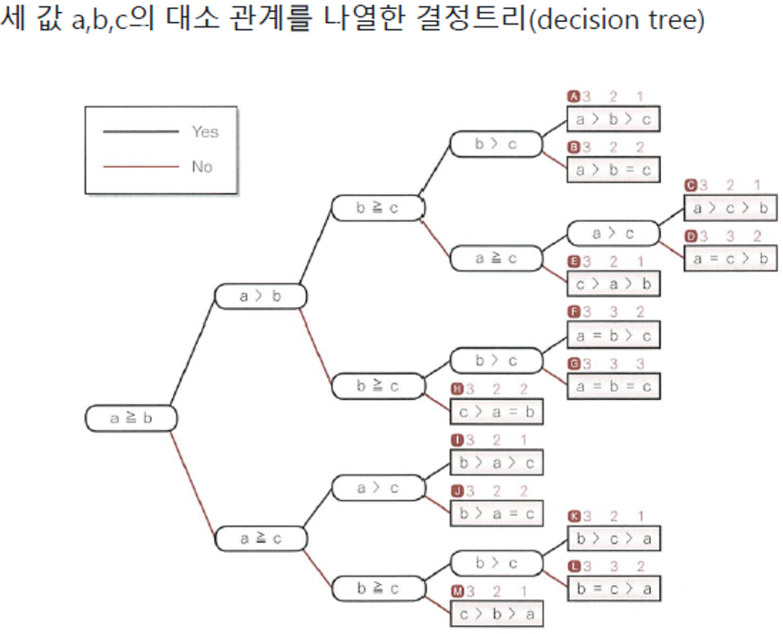

!!!
# 정은혁 
### 202530230
## 2025-09-18

# 정은혁 
### 202530230
## 2025-09-11

https://chocolatey.org/install

```
Set-ExecutionPolicy Bypass -Scope Process -Force; [System.Net.ServicePointManager]::SecurityProtocol = [System.Net.ServicePointManager]::SecurityProtocol -bor 3072; iex ((New-Object System.Net.WebClient).DownloadString('https://community.chocolatey.org/install.ps1'))
```
> 파워셀에서 **관리자 권한으로** 실행

<br>

```
choco --version
```
> 버전 확인

<br>

```
choco list
```
> 설치한 패키지 리스트 확인 가능

<br>

```
choco install mingw
```
> mingw 설치<br>
[mingw w64 13.2.0](https://community.chocolatey.org/packages?q=mingw "링크")

<br>

> vscode 확장에서 C/C++ 확장 다운로드

`설정에서 default branch 검색해서` <br>
`master 또는 main 맞게 변경`

<br>

```
gcc -o 만들파일이름 파일이름.확장자
```
`gcc -o hello hellocpp.cpp`
> 하면 .exe 생성됨

<br>

```
./만들파일이름
```
`./hello`
> 로 현재 디렉토리 명시하여 .exe 실행<br>

*Output* : `Hello, World!`

<br>

|cmd|powershell`PS`|bash|
|--|--|--|
|`>`|`PS>$`|`$`|


### 3개의 프롬프트는 각각 용도가 다름!

### 한글 깨지는 오류 해결
> vscode 우측 하단에 UTF-8누르고<br>
> reopen 메뉴 선택 <br>
> EUC-KR 검색후 선택

<br>

3항 연산자 : **a?b:c**

a가 참이면 b를 실행 거짓이면 c를 실행
<br>
`단순한 조건 같은 경우 3항 연산자 사용`

<br>

식(expression) : 

> 변수, 상수, 연산자 등을 사용하여 표현된 관계나  구조를 의미

<br>

알고리즘(Algorithm):
>어떤 문제를 해결하기 위한 논리적인 절차나 방법을 순서대로 기술한 것,
주로 **언어적인 표현 방식** 사용하고, **단계별로** 수행해야 할 동작들을 **순서대로** 나열

<br>

순서도(Flowchart):
> 일련의 처리 과정과 흐름을 시각적으로 보여주기 위해 **표준화된 기호**를 사용

<br>
관계 연산자
<br>

> < ,<= ,>= ,>

<br>
등가 연산자
<br>

> == ,!=
<br>

`등가 연산자는 2개 뿐이기에 거의 관계 연산자로 불림`

<br>

= 는 대입 연산자 
<br>
`오른쪽 값을 왼쪽에 대입`
<br>
<br>
=== 는 자바 스크립트에서 **완벽히 일치하는지 확인**
<br>
`5 == '5'도 True 이기에`
<br>
`5 === '5'는 데이터 타입까지 비교 따라서 False가 나옴`
<br><br><br>
Parameta(매개변수):
> 함수를 **정의할 때** 함수에 전달 받은 값을 저장하는 변수
<br>

Argument(인수):
> 함수를 **사용할 때** 매개변수로 전달할 값
<br>

`return값이 void인 경우 값을 반환하지 않음`

<br><br>
### 세 정수의 대소 관계와 중앙값
+ 세 정수의 대소 관계는 모두 13종류
+ 이 관계를 정리한 그래프를 decision tree(결정 트리)라고 합니다.
<br>




최댓값, 최솟값과는 다르게 중앙값을 찾는 절차는 매우 복잡
<br>
따라서 여러가지 알고리즘을 생각할 수 있음
<br>
세 정수의 중앙값을 구하는 절차는 Quick sort

--- 

N값이 양수면 [1] 음수면 [2], 둘다 아니면 0이므로 [3] 실행

---
# 정은혁 
### 202530230
## 2025-09-04
`맨 첫줄에 무조건 이름`<br>
`최근 내용이 가장 위에`

**mark down**
> test
# test
## test
|표|표|표|
|--|--|--|
|1|2|3|
|4|5|6|
|7|8|9|

> 1<br>
> 1<br>
> 2<br>
> 3
---
`test`
```html
<head>
    <body>
```
- test
* test
+ test
    + test
        + test
            + test
1. 오더드 리스트
2. 오더드 리스트
```python
print("hello world")
```


인라인 코드 블럭 예 : `<br>`
<br>
# 외부 링크 

[구글로 가기](https://google.com "구글 링크")


# [내부](#test) 
`#이 붙은 곳으로 이동`

# jeju

